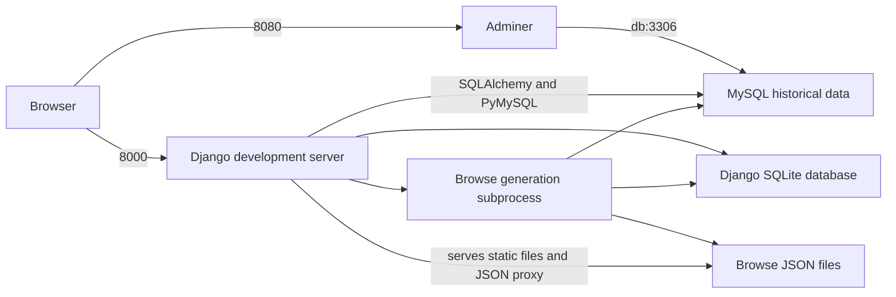

# Starting Docker architecture

Repository naming update: paths, links, and any reproduced prompts below use the current name `sr_input_form`. Existing local checkout directory names may differ. Historical implementation findings otherwise retain their original scope.

Analysis date: September 6, 2026. Application inspected: `sr_input_form`, branch `main`, commit `45bd376bd43195fdc1cd0c097d50c0638e25ac79`.

The current configuration describes a three-container development environment: Django, MySQL, and Adminer. It still installs Python dependencies with pip from `config/requirements_local.txt`. Neither `pyproject.toml` nor `uv.lock` participates in its build or startup.

**The existing Docker setup built and ran successfully after Docker Desktop was installed.** The isolated stack imported MySQL, started Django and Adminer, and regenerated browse data. Browser checks covered login, source/record/individual/group creation and editing, browse search/details/CSV export, Adminer, map, and timeline. Saved data survived restarting web and MySQL, and source autoreload worked. Two existing JavaScript errors prevent calling the editing interface entirely healthy; their details and the limits of verification are recorded below.

**`Dockerfile.dev` is actively selected by Compose.** Its additional SSH service is bypassed by the normal Compose startup command. Consolidating the two Dockerfiles looks reasonable, but simply deleting `Dockerfile.dev` would break the configured web build.

The original application checkout, Docker configuration, host databases, logs, and environment files were left unchanged. This report is in the enclosing directory; experiment files and copied starter data are under `/private/tmp/disa-docker-analysis-20260906/`.


## Contents

- [Components and data flow](#components-and-data-flow)
- [Build, settings, and startup](#build-settings-and-startup)
- [Storage and development behavior](#storage-and-development-behavior)
- [Assessment of the README](#assessment-of-the-readme)
- [Isolated startup attempt and verified results](#isolated-startup-attempt-and-verified-results)
- [Functionality to compare after the upgrade](#functionality-to-compare-after-the-upgrade)
- [Whether Dockerfile.dev can be removed](#whether-dockerfiledev-can-be-removed)
- [Implications for a later uv conversion](#implications-for-a-later-uv-conversion)
- [Continuing the isolated run](#continuing-the-isolated-run)
- [Initial prompt](#initial-prompt)


## Components and data flow

The primary source is [docker-compose.yml](https://github.com/Brown-University-Library/sr_input_form/blob/45bd376bd43195fdc1cd0c097d50c0638e25ac79/docker-compose.yml).

| Service | What supplies it | Purpose | Published host port | Configured container name |
| --- | --- | --- | --- | --- |
| `web` | Application directory, using `Dockerfile.dev` | Django development server and a browse-data generation subprocess | `8000` | `django-web-container` |
| `db` | Sibling `sr_dkr_sql-database` directory, using its own `Dockerfile` | MySQL historical data | `3306` | `db` |
| `adminer` | `adminer:latest` | Browser interface for inspecting and editing MySQL | `8080` | `sr-adminer` |



There are **two independent database configurations**:

- Django reads `DISA_DJ__DATABASES_JSON`. The Docker settings select `../DBs/dj_disa.sqlite`. This stores accounts, sessions, user profiles, permissions, and documents marked for deletion.
- SQLAlchemy reads `DISA_DJ__DATABASE_URL`. The Docker settings select MySQL database `stolenrelations` at `db:3306`, using PyMySQL. This stores sources, records, referents, relationships, groups, and associated historical information.

Adminer connects to MySQL; this Compose configuration does not give it access to Django's SQLite file. The published MySQL port allows host database clients to connect, but communication from `web` and Adminer uses the internal service address `db:3306`.

Compose also supplies `DB_HOST`, `DB_PORT`, `DB_NAME`, `DB_USER`, and `DB_PASSWORD` to `web`. Repository searches found no application reads of these variables. Changing them alone does not change either effective database connection. See [config/settings.py](https://github.com/Brown-University-Library/sr_input_form/blob/45bd376bd43195fdc1cd0c097d50c0638e25ac79/config/settings.py), [settings_app.py](https://github.com/Brown-University-Library/sr_input_form/blob/45bd376bd43195fdc1cd0c097d50c0638e25ac79/disa_app/settings_app.py), and [settings_localdev_env.sh](https://github.com/Brown-University-Library/sr_input_form/blob/45bd376bd43195fdc1cd0c097d50c0638e25ac79/config/settings_localdev_env.sh).

The sibling repositories are part of this architecture, even though they are separate Git repositories:

```text
outer-directory/
├── sr_input_form/                   # application; local checkout names may differ
├── sr_dkr_sql-database/             # MySQL Docker build and SQL dump
├── stolen_relations_start_data/     # Django SQLite seed and browse JSON
├── DBs/                            # working Django database
├── logs/                           # application log
└── cache_dir/                      # file cache location
```

The current companion database Dockerfile uses `FROM mysql:8.0`, copies its backup script into `/usr/local/bin/`, and copies `sr_inserts_together.sql` into `/docker-entrypoint-initdb.d/`. The image build includes the dump; MySQL imports it when initializing a fresh data directory at container startup. Existing initialized data is retained instead of reimported. [Companion Dockerfile at the inspected commit](https://github.com/Brown-University-Library/sr_dkr_sql-database/blob/cb0f909602f7291c164bd42d6b4ce6061f4d8935/Dockerfile), [official MySQL image initialization](https://hub.docker.com/_/mysql).

## Build, settings, and startup

### Web image

[Dockerfile](https://github.com/Brown-University-Library/sr_input_form/blob/45bd376bd43195fdc1cd0c097d50c0638e25ac79/Dockerfile) and [Dockerfile.dev](https://github.com/Brown-University-Library/sr_input_form/blob/45bd376bd43195fdc1cd0c097d50c0638e25ac79/Dockerfile.dev) have the same application setup:

1. Start with `python:3.9`.
2. Disable Python bytecode writes and enable unbuffered output.
3. Set the working directory to `/sr_project_stuff/code`.
4. Create `/sr_project_stuff/logs` and `/sr_project_stuff/DBs`.
5. Copy `config/requirements_local.txt` and install it with pip into the image's Python environment.

The image does not copy the application source. Compose supplies that source through bind mounts. The mounted source hides the requirements file copied into the image's working directory, but the installed Python packages remain available elsewhere in the image.

`Dockerfile.dev` then installs and configures OpenSSH, sets a fixed example root password, exposes port 22 in image metadata, and declares `sshd` as its default command. These build steps still execute even though normal Compose startup replaces the SSH command.

The Python base image, MySQL 8.0 image, and Adminer image are selected by tags rather than immutable digests. The requirements also include an unpinned Git reference for `shellvars-py`. These are sources of variation between builds even before a uv conversion.

### Environment loading

Compose parses `config/settings_localdev_env.sh` as an `env_file`; it does not execute it as a shell script. With the tested Compose version, its `export` declarations, quoted multiline JSON, and inline comments parse successfully.

Compose separately sets `DISA_DJ__ENV_SETTINGS_PATH=config/settings_localdev_env.sh`. In current `config/settings.py`, the presence of that variable skips loading the outer `.env`. It acts as a switch; the settings code does not open the path itself. The settings must already be in the environment, as Compose arranges.

This explains why Docker can still use the existing requirements without `python-dotenv`: the conditional import of that package occurs only in the outer `.env` path. The introductory comments in the shell settings file still describe older activation and Passenger behavior and are stale.

### What happens when web starts

Compose replaces the image command with a Bash command that:

1. Repeatedly tries a TCP connection to `db:3306`, with a one-second delay and no overall timeout.
2. Copies `stolen_relations_start_data/dj_disa.db` to `DBs/dj_disa.sqlite` if the destination file is absent.
3. Copies `browse_formatted.json` and `browse.json` into `disa_app/static/data/` if each destination is absent.
4. Runs `generate_browse_data_in_background.py`, which starts `python3 disa_app/lib/generate_browse_data.py` using `subprocess.Popen`.
5. Runs `python manage.py runserver 0.0.0.0:8000`.

The copy operations are linked with `&&`, so a failed required copy prevents the server from starting. There is no automatic `migrate`, `collectstatic`, or account-creation management command. The seeded SQLite database is expected to supply Django's existing schema and accounts. Application migrations are ignored by `.gitignore` and none are tracked at the inspected commit.

The browse subprocess queries both databases and writes the compact and formatted browse JSON. The launcher does not wait for completion or check the child's exit status. A successful server startup therefore does not establish that browse generation succeeded. Generation runs once per web-container startup, not continuously after every edit, and writes directly to the destination files. [Generation launcher](https://github.com/Brown-University-Library/sr_input_form/blob/45bd376bd43195fdc1cd0c097d50c0638e25ac79/disa_app/lib/generate_browse_data_in_background.py), [generator](https://github.com/Brown-University-Library/sr_input_form/blob/45bd376bd43195fdc1cd0c097d50c0638e25ac79/disa_app/lib/generate_browse_data.py).

The MySQL health check runs `mysqladmin ping`, but the short `depends_on` declarations do not wait for health. Web's TCP loop provides its own connection wait; it does not explicitly verify application credentials or schema. Adminer has only the startup ordering dependency. [Docker's startup-order explanation](https://docs.docker.com/compose/how-tos/startup-order/).

## Storage and development behavior

| Host location | Container location | Effect |
| --- | --- | --- |
| Entire enclosing directory, `../` | `/sr_project_stuff` in web | Makes siblings and other outer-directory files accessible to the container |
| `../DBs` | `/sr_project_stuff/DBs` in web | SQLite changes persist on the host |
| `../logs` | `/sr_project_stuff/logs` in web | Application log persists on the host |
| Application directory, `.` | `/sr_project_stuff/code` in web | Live source, templates, Git metadata, and generated JSON are available |
| `../sr_dkr_sql-database/backups` | `/sr-backups` in db | Manual MySQL dumps persist on the host |

The explicit DB and log mounts overlap the enclosing-directory mount. All these mounts are writable. The broad enclosing-directory mount would expose the existing outer `.env` and other host development material to the normal web container, even though the Docker settings bypass dotenv loading. This is why the experiment uses a separately copied directory tree.

Python source changes are picked up by Django's development autoreloader. This was verified by temporarily adding a marker to the copied `/info/?format=json` response, observing it through the running container, and restoring the copied file exactly. Dependencies are installed while building the image, so editing a dependency list requires a rebuild. Generated browse data is ignored by Git but is written into the host source directory. Logs go to `../logs/stolen_relations.log` and console output. The configured file cache is `../cache_dir`, with a timeout of zero.

The declared `db_data` volume is unused: its `/var/lib/mysql` mount is commented out. Compose's resolved configuration drops the unused declaration. **Container inspection confirmed an anonymous volume at `/var/lib/mysql`.** The official MySQL image declares that data volume. Anonymous volumes can survive container removal, but `down` followed by `up` does not automatically reconnect them. Restart persistence passed in this experiment; complete teardown/recreation was not tested and must not be assumed to preserve MySQL edits. [MySQL 8.0 image definition](https://github.com/docker-library/mysql/blob/7cf11d5360282effadb347353d5f82339506b106/8.0/Dockerfile.oracle), [Compose down behavior](https://docs.docker.com/reference/cli/docker/compose/down/).

The current companion backup script prompts for the MySQL root password and writes a timestamped `sr_inserts_separate_*.sql` file under `/sr-backups`. It does not overwrite the initialization dump, despite the companion README's older description. Running it in the sandbox succeeded and produced a 46,003,632-byte dump with 43 table definitions and a completion footer. Restoration was not tested. Backups require an explicit invocation; no backup scheduler is configured. [Inspected backup script](https://github.com/Brown-University-Library/sr_dkr_sql-database/blob/cb0f909602f7291c164bd42d6b4ce6061f4d8935/backups/sr-db-backup.sh).

No reverse proxy, Shibboleth service, mail server, frontend build service, or scheduled-job service is defined. Browser pages load some JavaScript and CSS from external CDNs; a successful HTML response will not establish that the complete browser interface works offline.

## Assessment of the README

The [README's Docker instructions](https://github.com/Brown-University-Library/sr_input_form/blob/45bd376bd43195fdc1cd0c097d50c0638e25ac79/README.md) broadly match the source: clone three repositories as siblings, start Compose from the application, and visit ports 8000 and 8080. **That overall approach worked with the current companion repositories and unchanged Dockerfiles/startup command.** The experiment used an isolated copy, alternate loopback ports, and Compose's current `docker compose` spelling; it was not a literal run against the original checkout and fixed container names.

| README statement or omission | Assessment |
| --- | --- |
| Docker must be installed and running | Essential. The first attempt stopped here; after the user installed and started Docker Desktop, building and startup succeeded. |
| Clone both data repositories beside the application | Correct. Neither was initially present at the expected path here; both were obtained in the separate experiment directory. Access to private starter data is a prerequisite. |
| Clone `sr_input_form`, then enter `sr_input_form` | Correct current repository name, as confirmed by the user after this analysis. The inspected checkout's origin still used a former name; that local setting did not establish the current GitHub name. The application folder's basename is flexible because Compose mounts it as `code`. |
| Run `docker-compose up` | The standalone hyphenated command validated the configuration during the first attempt. The successful run used Docker Desktop's `docker compose up --build --detach`. |
| This creates “the container” | It defines three containers, including Adminer and MySQL. |
| Visit `/version/` and `/login/` | Useful first checks, but neither proves that historical data is queryable, saves work, or browse generation completed. `/version/` also needs the Git executable and checkout metadata. |
| `up --build` may not create a replacement image, and later runs may use the old image | Incorrect. `--build` builds before startup; Compose uses the resulting service image and recreates containers when the image or configuration changes. Deleting images is unnecessary for routine rebuilds. [Compose up reference](https://docs.docker.com/reference/cli/docker/compose/up/). |
| Starter data is described mainly as login information | Incomplete: it supplies a prebuilt Django schema and the initial browse JSON as well. |
| No discussion of database persistence or ports already in use | Fixed container names and fixed ports prevent a second stack from being isolated merely by adding `-p`. MySQL's unused named volume deserves explicit documentation. |
| No distinction between local and institutional login | Local hostnames on port 8000 trigger simulated Shibboleth identity. This setup does not run institutional single sign-on. |

The shell-style environment file was not a parsing blocker in standalone Compose 2.39.4 or Docker Desktop's Compose 5.5.0. Compatibility with older colleague-installed versions remains untested. Docker documents the standalone hyphenated command separately from the current plugin invocation. [Compose installation documentation](https://docs.docker.com/compose/install/standalone/).

## Isolated startup attempt and verified results

### Exact inputs

| Input | Version or commit |
| --- | --- |
| Application | `45bd376bd43195fdc1cd0c097d50c0638e25ac79` |
| Companion MySQL repository, `main` | `cb0f909602f7291c164bd42d6b4ce6061f4d8935` |
| Starter-data repository, `main` | `c5d334476c394cb4a4ad412ca7034f100d86f141` |
| Docker Desktop | `4.89.0 (238018)` on macOS; local `desktop-linux` context |
| Docker CLI / Engine | `29.7.2` / `29.7.2`; Linux ARM64 containers |
| Compose used for successful build/run | `5.5.0` |
| Standalone Compose used before Desktop installation | `v2.39.4`, Darwin ARM64; downloaded to the temporary directory and verified against the release SHA-256 checksum |
| Web interpreter and main packages actually installed | Python `3.9.25`, Django `3.2.25`, SQLAlchemy `1.3.12`, PyMySQL `1.1.2` |
| MySQL / Adminer actually running | `8.0.46` / `6.0.1` |

The existing `temp_sql_clone/sr_dkr_sql-database` is on a 2023 feature branch at `98d85ad`, with a different Dockerfile. It was inspected but was not substituted for the current companion repository. The current repository files and starter-data archives were retrieved through the user's existing GitHub CLI access after the GitHub connector could not access them.

The application was cloned locally into the temporary stack directory, preserving Git metadata and excluding ignored host databases, generated JSON, and the host `.venv`. Companion archives were retrieved at the commits above. Existing host data and outer `.env` values were not copied.

The standalone sandbox Compose file preserves the existing build files, environment values, startup command, and mount destinations. Its deliberate isolation changes are:

- Build contexts and every host bind mount point inside the temporary stack directory.
- Explicit global container names are removed; the Compose name is `disa-architecture-audit`.
- Ports bind to loopback only: web `18000`, Adminer `18080`, MySQL `13306`.
- Automatic restart policies are disabled for the experiment.
- The successful run explicitly targets Docker Desktop's local `desktop-linux` context.

### Initial prerequisite failure

Before Docker Desktop was installed, normal Docker commands were unavailable and the usual Docker socket paths did not exist. A temporary standalone Compose binary validated the configuration, but `up --build --detach` exited 1 because it could not connect to the local Docker daemon. No images or containers were created by that first attempt. After the user installed and started Docker Desktop, the same prepared sandbox built and ran successfully. The failure was an environment prerequisite, not an application build failure.

### Build and runtime results

| Check actually performed | Result |
| --- | --- |
| Validate original Compose | Passed; resolved `web`, `db`, and `adminer`. |
| Check required application settings against resolved web environment | All 26 required keys present. |
| Parse JSON-valued settings | All 12 checked JSON values valid. |
| Check extracted startup command with `bash -n` | Passed. |
| Validate separate sandbox Compose configuration | Passed. |
| Check starter SQLite read-only | `PRAGMA quick_check` returned `ok`; Django auth, session, profile, and deletion-marker tables exist; 19 migration records. |
| Build web and database images and start with `up --build --detach` | Passed with existing Dockerfiles, requirements, and startup command. Adminer pulled successfully. |
| MySQL initialization | Passed; healthy container, 43 imported tables, application queries succeeded. Initial counts: 2,001 citations, 2,950 references, 8,395 referents, 239 groups. |
| SQLite and initial browse-file copying | Passed into sandbox bind mounts; manual login and Django sessions worked. |
| Background browse generation | Passed; initial current-data output contained 8,377 referents and 239 groups, with 18 referents excluded. It took about 45 seconds. |
| Installed-package consistency, `python -m pip check` | Passed: no broken requirements found. |
| HTTP checks against running Django | All 43 checks passed, both before and after restarting MySQL and web. These include page/data responses, login/logout, persisted fields, missing-source 404, missing-CSRF 403, and malformed-JSON 400. |
| Browser interactions | Main editing, browse, Adminer, map, and timeline checks completed, with existing editing JavaScript errors documented below. |
| Restart persistence | Disposable account, source, record, individual, and group survived `compose restart db web`. |
| Host source autoreload | Passed; a temporary response marker appeared without rebuilding and disappeared after exact source restoration. |
| MySQL backup script | Passed; timestamped dump appeared in the sandbox host backup directory. Restore not tested. |

### Dataset reference and reproducibility

The starter browse JSON was produced on `2022-07-29`; its two representations compare equal after parsing. It contains 4,174 referents, excludes 93, and contains 101 groups spanning 86 records. **Those are not the fresh-build browse counts.** Generation against the current SQL dump replaces that older snapshot.

| State | Browse referents | Excluded referents | Groups | Records with groups |
| --- | ---: | ---: | ---: | ---: |
| Bundled starter JSON | 4,174 | 93 | 101 | 86 |
| First completed generation, before disposable edits | 8,377 | 18 | 239 | 205 |
| Regeneration after adding the demonstration individual/group | 8,378 | 18 | 240 | 206 |
| Final regeneration after the separate deletion check | 8,378 | 19 | 240 | 206 |

The initial browser displayed 8,377 people from 2,875 archival records. The initial source-dashboard API returned 1,685 document rows. These are filtered application outputs, so they should not be confused with raw table counts. The final generation metadata reports `2026-09-06 09:05:11.347997` and an elapsed time of about 37 seconds. The three measured generation runs took approximately 36–45 seconds on this computer; this is an observation, not a performance requirement.

Exact seed SHA-256 hashes are retained in `seed-hashes.json`. Built web/database image IDs and the Adminer image digest are retained in `image-versions.json`. The web build resolved the unpinned `shellvars-py` dependency to commit `a9208f837c819fec6291b6e2b36aae6d6fb2c59d`. Keep those inputs alongside this report when comparing a later build; floating tags and a changing companion repository can otherwise introduce unrelated differences.

The stack remains running on loopback ports for inspection. Its directory is restricted to the local user because it contains private starter data. No original application files or host data were changed; all accounts, edits, deletion markers, generated files, and backups created during the run belong to the temporary copy.

The full Python test suite was not run for this analysis-only task; the checks above exercised the disposable running stack. The existing `DockerTest` checks whether requirements files referenced by the two Dockerfiles exist; it does not build containers, validate Compose startup, or exercise the running interface. [Existing Docker test](https://github.com/Brown-University-Library/sr_input_form/blob/45bd376bd43195fdc1cd0c097d50c0638e25ac79/disa_app/tests/test_other.py).

## Functionality to compare after the upgrade

The running application offers two main workflows: entering historical sources and their associated records/people/groups, and exploring generated browse data. Django admin and Adminer are separate administrative interfaces. The map and timeline use their own static datasets. The public `stolenrelations.org` website itself is not part of this Compose stack. Route definitions are in [config/urls.py](https://github.com/Brown-University-Library/sr_input_form/blob/45bd376bd43195fdc1cd0c097d50c0638e25ac79/config/urls.py).

### Verified functionality

| Area | Observed behavior and useful comparison |
| --- | --- |
| Server identity and landing page | `/version/` returned JSON identifying the copied checkout. `/` redirected to `/info/`, which rendered the public-site and partner-browse information. |
| Manual login and sessions | Login page rendered; the disposable username/password worked in the browser. HTTP checks rejected an incorrect password, accepted the correct one, and verified logout blocked the dashboard again. |
| Simulated institutional login | With a recognized port-8000 Host header, `/shib_login/` followed the example-identity path and allowed dashboard access. With the actual alternate-port host, it redirected to `/login/`. No real institutional SSO was tested. |
| Source dashboard | `/redesign_citations/` populated after turning off “Show only your entries,” which defaults on and initially left the new account's table empty. Source-ID filtering isolated an existing source, and “Create a new source” opened the editor. Title/editor filters were not separately exercised. |
| Source editing | Created source `3196`, chose Book, entered a title, author, and date, and saved it. Reload showed the saved title; HTTP assertions confirmed title and author. The title heading did not immediately refresh on the first save. |
| Record editing | Created record `3885` under that source and saved synthetic transcription and researcher notes. The transcription survived reload and container restart. A JavaScript error occurred after first save, described below. Date/location widgets were not fully tested. |
| Individual editing | Added referent `10385`, named “Docker Baseline,” and edited a text field. Reload and HTTP checks confirmed the stored values; the individual appeared in regenerated browse data. |
| Group editing | Added a group with description “DOCKER BASELINE disposable group,” count `3`, and the estimated-count option enabled. All three fields survived reload and restart. Relationship editing and group removal were not tested. |
| Source deletion | Created a second source `3197`, record `3886`, and referent `10386` through the API, then deleted that source. The response reported success; Django contained the deletion marker, MySQL retained the source row, and regenerated browse data excluded its referent. The first demonstration referent remained. This tested the endpoint, not the dashboard's deletion controls or the full permissions matrix. |
| Partner browse authentication | Separate HTTP session logged in using configured example browse credentials and logged out successfully. The browser also accessed browse through the authenticated editor session. |
| Browse search and details | `/browse/` populated after its introductory acknowledgement. Searching “Portsmouth” returned matches; a deliberately unmatched string displayed “No records match these criteria.” A details dialog opened with personal details and source information. |
| CSV export | The browse download button produced a CSV for the “Portsmouth” results: 202 data rows, 15 columns, 377,128 bytes. Columns include names/status, locations/year, transcription, referent and reference IDs, relationships, and citation. |
| Browse data delivery | `/browse.json` returned valid, freshly generated JSON through the existing internal proxy. Counts and completion metadata were checked after generation, including the deletion case. |
| Django admin boundary | An ordinary editor's `/admin/` request redirected to admin login. Privileged admin operations were not tested. |
| Adminer | Browser login to server `db`, database `stolenrelations`, succeeded; 43 tables were listed. No table editing was performed through Adminer. |
| Map and timeline | `/map/` displayed a basemap with clustered markers. `/timeline/` displayed populated dated events. Their tracked `SR_geo.json` and `timeline.json` files served successfully. These datasets are not rebuilt by Compose. |
| Development and restart | Host Python edits triggered autoreload without an image rebuild. After restarting web and MySQL, all 43 HTTP checks passed again, including stored source, record, individual, and group fields. Backup output and application logs were present on the sandbox host. |

### Disposable account and demonstration data

For browser testing at port 18000, a new ordinary editor was created only in the copied databases: Django user `docker_baseline_audit`, with a profile linked to a new MySQL user. It is not a staff or superuser account. This was experiment preparation, not an account automatically created by Compose.

The retained source is titled **DOCKER BASELINE 2026-09-06 — disposable source**, at `/redesign_citations/3196/`. Its record text explicitly identifies it as synthetic test material. The deletion-check source is separately labeled and marked for deletion. The sandbox is therefore no longer a pristine seed: reuse its demonstration values for persistence checks, or recreate fresh disposable databases from the recorded seed inputs for clean-build comparisons.

### Existing interface errors and limits

Two browser-console errors occurred with the existing application code:

1. First saving a new record raised `TypeError: Cannot read properties of undefined (reading 'locations')` at [entry_form_vue-item_mixin_save.js](https://github.com/Brown-University-Library/sr_input_form/blob/45bd376bd43195fdc1cd0c097d50c0638e25ac79/disa_app/static/js/entry_form_vue-item_mixin_save.js), line 477. The new-record endpoint returns a redirect value, while the shared save handler subsequently reads `dataJSON.rec.locations`. That mismatch is visible in [view_data_records_manager.py](https://github.com/Brown-University-Library/sr_input_form/blob/45bd376bd43195fdc1cd0c097d50c0638e25ac79/disa_app/lib/view_data_records_manager.py), around line 218. The new record was created and its text persisted despite the client-side error.
2. Reloading the editor after adding the individual/group emitted a Vue render error, `TypeError: Cannot read properties of undefined (reading 'value')`. The underlying field was not diagnosed. The saved source, record, individual, and group values were independently verified, but this does not establish that every editor widget rendered correctly.

Some browse narratives also displayed a raw GeoJSON point or a location identifier such as `Q1787188` in location text. This was visible with the current dataset and code. These observations belong in the baseline; none was repaired as part of this analysis.

One exploratory API request supplied an invalid record-type shape and received HTTP 200 with `{}` while the server logged a `TypeError`; no record was created by that request. Repeating with the UI's expected record-type object succeeded. This was an invalid test payload, not evidence that the normal creation request failed, but it shows that a 200 response alone is not sufficient evidence of a successful save.

Remaining checks before claiming full functional equivalence include relationship creation/update/removal, all date/location and vocabulary controls, privileged Django-admin operations, deletion permission differences, Adminer edits, backup restoration, and full container teardown/recreation. No production authentication, production data, offline-CDN behavior, or actual colleague IDE integration was tested.

Source inspection also identifies existing features with limited or uncertain use: `/unify/` returned HTTP 200, but its template explicitly disables saving; `/redesign_home/` returns placeholder text. Older `/editor/…`, `/search_results/`, `/datafile/`, and `/utility/…` routes remain present but were not comprehensively exercised. Missing persistent unification should not be attributed to a future uv change.

### Comparison details that can otherwise look like regressions

The simulated Shibboleth helper recognizes `127.0.0.1`, `localhost`, those names with `:8000`, and `testserver`. It does **not** recognize `127.0.0.1:18000`. For an HTTP-level check through the alternate port, explicitly sending `Host: 127.0.0.1:8000` preserves that branch. A normal browser at port 18000 needs a disposable username/password account or a local forwarding arrangement that preserves the recognized host. This is existing application behavior. [Authentication helper](https://github.com/Brown-University-Library/sr_input_form/blob/45bd376bd43195fdc1cd0c097d50c0638e25ac79/disa_app/lib/shib_auth.py).

The browse proxy's configured `http://127.0.0.1:8000/static/data/browse.json` is requested by Python inside the web container. It should retain the internal port 8000 when only the published host port changes. Browser pages mostly use relative routes; avoid changing all occurrences of 8000 indiscriminately.

Capture the generated JSON's completion time and counts after the job finishes, rather than comparing immediately after startup. The generator also reads Django deletion markers. The two versions need the same starting SQL dump, SQLite seed, and deletion state for a meaningful comparison.

Use uniquely labeled disposable records for save/delete checks, and retain before/after counts or response summaries. A successful `/version/` request is a first checkpoint; the important functional comparison is a populated dashboard, a persisted edit, and freshly generated browse data.

## Whether Dockerfile.dev can be removed

The colleague's observation fits the **SSH feature**, but not the complete file:

1. `services.web.build.dockerfile` is explicitly `Dockerfile.dev`, confirmed in the resolved Compose configuration. Deleting that file alone breaks the build.
2. Its first application-build section matches `Dockerfile` exactly. The only additional instructions concern SSH.
3. Compose's `command` overrides the image's `CMD`, so the normal stack starts the copy/generation/runserver sequence instead of `/usr/sbin/sshd -D`. This follows Docker's documented command behavior. [Compose command reference](https://docs.docker.com/reference/compose-file/services/#command).
4. Compose does not publish port 22, and its startup command contains no SSH daemon invocation. Inspection of the running web container showed Django `runserver` processes and no running `sshd`. Thus SSH is not part of the documented and tested Compose workflow.
5. No additional checked-in IDE configuration or startup script was found that starts SSH. `.vscode` is ignored, and colleagues may have personal configurations outside this repository; their use cannot be excluded from repository evidence.
6. The existing Docker test opens both filenames explicitly, so it would also need updating if one file is removed.

**Recommendation for the later implementation:** use one web Dockerfile, point Compose to it, and update the filename-dependent test. Preserve the shared build behavior first and verify the functional checklist. The SSH instructions appear removable from the documented workflow. Before permanently discarding SSH support, the remaining factual question is whether anyone launches the image separately as an SSH-based IDE interpreter; that cannot be answered from this checkout. No file was removed during this analysis.

## Implications for a later uv conversion

- **Resolve the Python-version difference explicitly.** Current Docker uses Python 3.9; `pyproject.toml` requires `>=3.8,<3.9`. Installing uv in the existing image is not sufficient to make that interpreter satisfy the declaration.
- **Use the declared and locked dependencies deliberately.** Docker currently uses PyMySQL 1.1.2; TOML pins 1.1.1. TOML adds `python-dotenv` and omits legacy pip-tools/build tooling and `shellvars-py`. Treat those differences as part of the change being evaluated. Core Django and SQLAlchemy pins match.
- **Keep both database connections and seed behavior visible.** Replacing pip should preserve SQLite initialization, MySQL import, accounts/profiles, deletion markers, and browse generation unless those are separately redesigned and checked.
- **Make the subprocess use the intended environment.** The launcher invokes `python3` by name. The uv environment must also be used by that child process, not only by `manage.py`.
- **Account for bind mounts when locating the virtual environment.** A `.venv` created inside `/sr_project_stuff/code` during image build would be covered by the source mount. A host `.venv` in the checkout could also become visible there. Choose a container-owned environment location or an explicit mount strategy.
- **Add an intentional build-context exclusion list.** There is no application `.dockerignore`. The new uv environment, Git data, and generated assets need consideration when deciding what is sent to a build and copied into an image. Git metadata also supports `/version/` at runtime.
- **Preserve settings selection intentionally.** Removing `DISA_DJ__ENV_SETTINGS_PATH` without changing settings behavior would switch Docker into requiring the outer `.env`.
- **Separate dependency conversion from existing operational problems.** The unused MySQL named volume, unchecked background generation, local-login port restriction, and old seed JSON already exist. Record their baseline behavior so they are not mistaken for changes introduced by uv.

These are implementation considerations, not changes applied by this report. The successful existing build and recorded browser checks now provide a practical reference for a uv conversion. The untested workflows and existing interface errors still limit any claim of complete equivalence.

## Continuing the isolated run

Docker Desktop is running, and the isolated stack is left available for inspection:

- Application login: <http://127.0.0.1:18000/login/>; use the disposable account above.
- Demonstration source: <http://127.0.0.1:18000/redesign_citations/3196/> after login.
- Browse: <http://127.0.0.1:18000/browse/>.
- Adminer: <http://127.0.0.1:18080/>; server `db`, user `user`, password `user`, database `stolenrelations`, using the existing development settings.
- MySQL for a host client: `127.0.0.1:13306`.

Inspect this specific stack with:

```bash
docker --context desktop-linux compose -p disa-architecture-audit \
  -f /private/tmp/disa-docker-analysis-20260906/compose.sandbox.json ps
docker --context desktop-linux compose -p disa-architecture-audit \
  -f /private/tmp/disa-docker-analysis-20260906/compose.sandbox.json logs --tail=150 web db
```

To stop it while keeping the current containers and data, then resume later:

```bash
docker --context desktop-linux compose -p disa-architecture-audit \
  -f /private/tmp/disa-docker-analysis-20260906/compose.sandbox.json stop
docker --context desktop-linux compose -p disa-architecture-audit \
  -f /private/tmp/disa-docker-analysis-20260906/compose.sandbox.json start
```

The successful build/start command was:

```bash
docker --context desktop-linux compose -p disa-architecture-audit \
  -f /private/tmp/disa-docker-analysis-20260906/compose.sandbox.json up --build --detach
```

A port-8000 simulated-login check can be sent through the alternate mapping with:

```bash
curl -i -H 'Host: 127.0.0.1:8000' \
  http://127.0.0.1:18000/shib_login/
```

To regenerate browse data after further disposable edits and wait for completion:

```bash
docker --context desktop-linux compose -p disa-architecture-audit \
  -f /private/tmp/disa-docker-analysis-20260906/compose.sandbox.json \
  exec -T web python disa_app/lib/generate_browse_data.py
```

Run that after any startup generator has finished. This explicit foreground invocation was used for the deletion comparison; the usual startup invocation remains asynchronous.

When finished with the experiment, the following cleanup command targets only this explicitly named sandbox and its volumes:

```bash
docker --context desktop-linux compose -p disa-architecture-audit \
  -f /private/tmp/disa-docker-analysis-20260906/compose.sandbox.json down --volumes --remove-orphans
```

That removes container volumes, including disposable MySQL data, but does not delete the sandbox's bind-mounted SQLite database or generated files. It was not run during this analysis. To reproduce a clean initial dataset, reset both copied databases and browse files together; restarting from the SQL seed while retaining the edited SQLite deletion markers is a different starting state.

The temporary directory may be cleaned by the operating system, so retain it separately if this exact runtime evidence is needed for a later comparison. Recreating it requires the recorded application/companion commits and access to the starter-data repository.

Useful retained evidence under `/private/tmp/disa-docker-analysis-20260906/`:

| Files | Contents |
| --- | --- |
| `compose-resolved.json`, `compose.sandbox.json`, `validation-summary.json`, `startup-command.sh` | Resolved original configuration, isolated configuration, and prerequisite checks |
| `up-attempt.log`, `up-attempt-summary.json`, `build-and-up.log` | Initial missing-engine failure and later successful build/start |
| `seed-hashes.json`, `image-versions.json`, `running-containers.json` | Exact seed hashes, image identifiers, ports, and actual volume mounts |
| `stack/initial-database-counts.json`, `http-results-before-restart.json`, `stack/http-baseline-results.json` | Initial table counts and all 43 before/after-restart HTTP checks |
| `stack/deletion-result.json`, `stack/final-runtime-checks.json`, `generation-after-deletion.log` | Deletion response, retained MySQL row/Django marker, and final generation metadata |
| `csv-export-summary.json`, `disa-data-export_1788699609792.csv` | Browser CSV export and its row/column summary |
| `restart.log`, `autoreload-check.log`, `backup-check.log` | Restart, host-source reload, and backup command outcomes |
| `stack/logs/`, `stack/sr_dkr_sql-database/backups/` | Application logs and generated SQL backup |

Browser observations and console errors are described in this report; the HTTP helper does not test browser rendering. The temporary Python helpers under `stack/` are experiment tools, not additions to the application's test suite. Their disposable IDs and date-specific assertions would need adjustment for a newly seeded run.

## Initial prompt

Goal: Analyze the current docker setup.

Context:

- One team that supports our servers, and does some development, uses `uv` and `pyproject.toml` -- and we've upgraded this project to deploy that way.

- Another team working on this particular project does all their development via docker.

- I'm pretty familiar with docker, but don't use it for development. I want to update this docker setup so that still works for the folk who use it -- but moves to using `uv` and `pyproject.toml` under-the-hood.

- Before making changes to the project, I want to understand it's docker setup. 

- Note that there are docker startup instructions in the `sr_input_form/README.md` -- I think they're accurate -- but I'm not sure.

Tasks:

- Analyze the current docker setup. Save useful information to `REPORT__starting_docker_architecture.md`.

- See if you can get this project running in some sandbox way, using the docker approach.

- If it works, make some notes about the functionality it offers once it's up and running. The purpose of this will be to be able to compare an upgraded "tomlized" version of the docker setup -- to ensure existing functionality isn't degraded. Save these notes to an appropriate section of the `REPORT__starting_docker_architecture.md` file.

- A colleague told me that ze thought the `sr_input_form/Dockerfile.dev` wasn't even used in a functional way, and could probably be removed. Include an analysis of this in your report.

- Before starting the analysis, ask me one or two clarifying questions.

---
